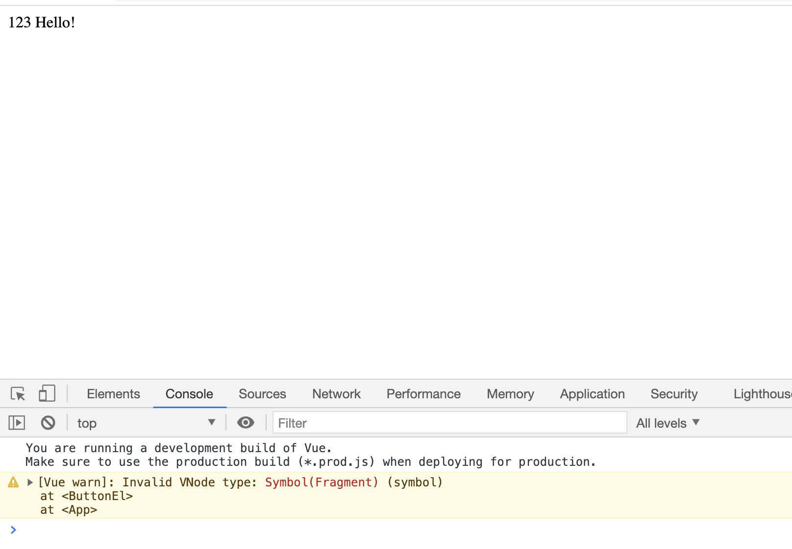

### Reproducible issue with Vue `Invalid VNode type: Symbol(Fragment) (symbol)` 

```bash
npm ci
npm run build
```

then open `index.html`

and you'll see 
where button is missed and warning in console.
